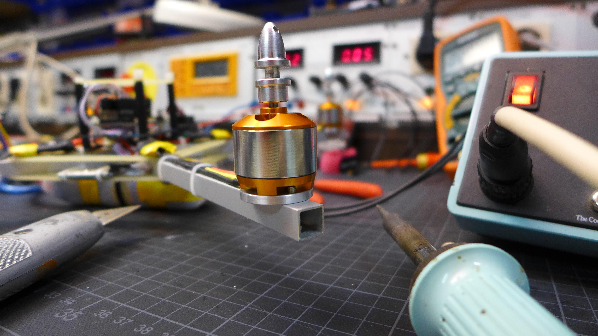

Das Labor e.V.
==============

Wer bastelt hat Recht
---------------------

Das LABOR fungiert in erster Linie als Ort des Schaffens in einer Community: Wir entwickeln und benutzen freie Software. Wir löten, ätzen, programmieren Mikrocontroller und basteln Antennen – Kurz: Wir haben den Anspruch mit Technologie Neues und Sinnvolles zu gestalten.

Nächster Termin für Hereingucker
--------------------------------

Wenn du am Labor teilhaben möchtest komm doch einfach vorbei! Ob das Labor geöffnet ist, erkennst du am [Status-Bot](https://www.das-labor.org/status/).
Montags ist oft besonders viel los.
